<picture> <source media="(prefers-color-scheme: dark)" srcset="dark.svg"> <source media="(prefers-color-scheme: light)" srcset="light.svg">  </picture>

## 📊 GitHub Stats & Trophies

  
  

  

  

## 🛠️ Languages & Tools

<h3 align="center">Programming Languages</h3>

  &nbsp;&nbsp;
  &nbsp;&nbsp;
  &nbsp;&nbsp;
  

<h3 align="center">Frontend</h3>

  &nbsp;&nbsp;
  &nbsp;&nbsp;
  &nbsp;&nbsp;
  &nbsp;&nbsp;
  

<h3 align="center">Database</h3>

  &nbsp;&nbsp;
  &nbsp;&nbsp;
  

<h3 align="center">Tools</h3>

  &nbsp;&nbsp;
  &nbsp;&nbsp;
  

  

## 🔗 Connect with Me

  &nbsp;&nbsp;
  

<picture>
  <source
    media="(prefers-color-scheme: dark)"
    srcset="https://raw.githubusercontent.com/syrmlia/syrmlia/output/pacman-contribution-graph-dark.svg"
  >
  <source
    media="(prefers-color-scheme: light)"
    srcset="https://raw.githubusercontent.com/syrmlia/syrmlia/output/pacman-contribution-graph.svg"
  >
  
</picture>

  

  

